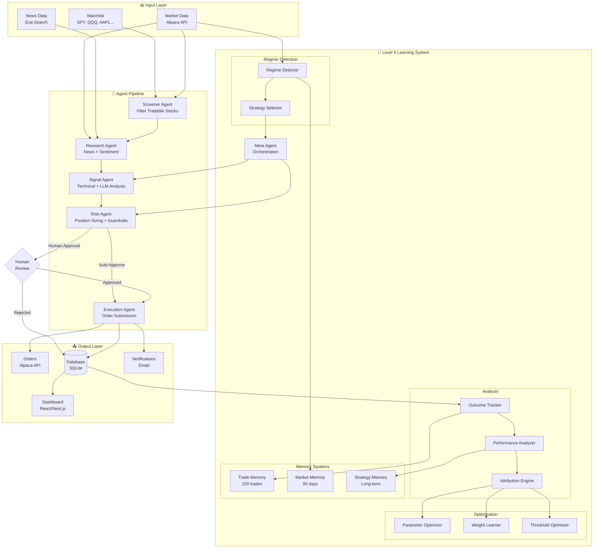
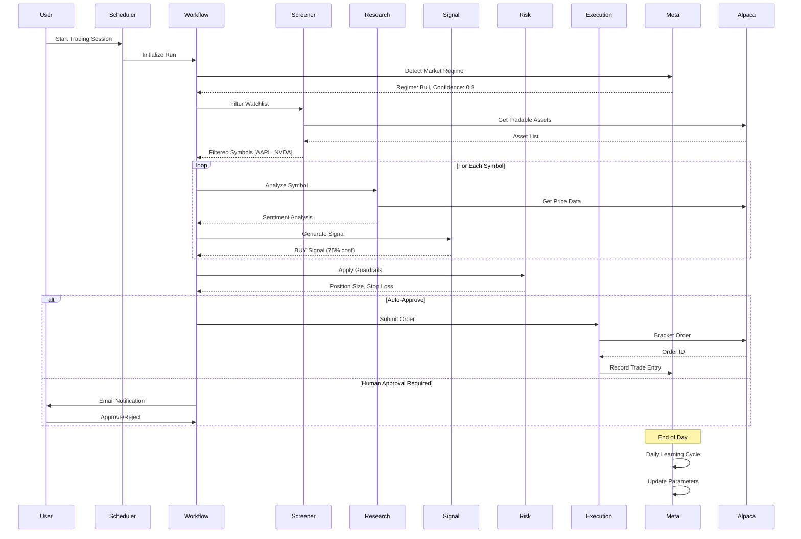
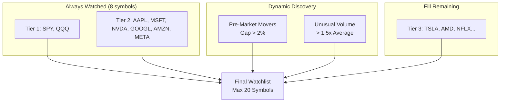
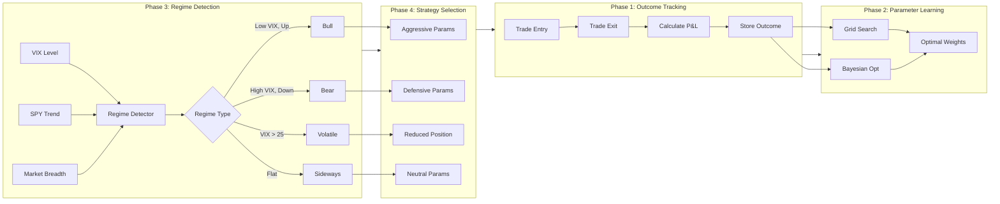

# 🤖 Trading Agent

A **Level 4 autonomous adaptive trading system** with machine learning capabilities for swing trading US stocks using LangGraph workflow orchestration, Alpaca Trading API, and OpenAI GPT-4.


---

## 📋 Table of Contents

- [Features](#-features)
- [Architecture](#-architecture)
- [Dynamic Watchlist](#-dynamic-watchlist)
- [Level 4 Learning System](#-level-4-learning-system)
- [Quick Start](#-quick-start)
- [Configuration](#-configuration)
- [CLI Commands](#-cli-commands)
- [Trading Strategy](#-trading-strategy)
  - [Technical Indicators](#technical-indicators)
- [Risk Management](#-risk-management)
- [Dashboard](#-dashboard)
- [Project Structure](#-project-structure)
- [Testing](#-testing)
- [API Reference](#-api-reference)
- [Troubleshooting](#-troubleshooting)
- [Caching System](#-caching-system)
- [Disclaimer](#-disclaimer)

---

## ✨ Features

### Multi-Agent System
- **6 Specialized Agents**: Screener → Research → Signal → Risk → Execution + Meta-Learning
- **LangGraph Orchestration**: State-driven workflow with conditional branching
- **Autonomous Operation**: Level 4 autonomy with adaptive learning and guardrails

### Dynamic Watchlist Scanner
- **Tiered Stock Selection**: Core indices (SPY, QQQ) and mega caps always watched
- **Pre-Market Movers**: Automatically detects stocks gapping >2%
- **Unusual Volume**: Scans for stocks with >1.5x average volume
- **Sector Rotation**: Tracks sector ETF performance for opportunity identification

### Hybrid Trading Strategy
- **Technical Analysis**: RSI, MACD, SMA (20/50/200), Bollinger Bands, ATR-based stops
- **Sentiment Analysis**: News sentiment via Exa search + OpenAI GPT-4
- **LLM Reasoning**: GPT-4 provides contextual analysis and trade rationale

### Adaptive Learning (Level 4+)
- **Outcome Tracking**: Records every trade with full signal context
- **Parameter Optimization**: Grid search and Bayesian optimization
- **Market Regime Detection**: Adapts strategy to bull/bear/volatile markets
- **Pattern Discovery**: Learns from historical performance
- **Memory Systems**: Short, medium, and long-term trading memory

### Risk Management
- **15+ Guardrails**: Position limits, sector exposure, daily loss limits
- **Automatic Stop-Loss**: ATR-based dynamic stop-loss calculation
- **Human-in-the-Loop**: Approval required for trades exceeding thresholds
- **CAPM Integration**: Beta-adjusted position sizing for risk-weighted exposure
- **Correlation Analysis**: Reduces position sizes for correlated holdings
- **Position Scaling**: 50% initial entry with 25% scale-in on pullbacks/breakouts

### Advanced Exit Strategies
- **Dynamic Take Profits**: Support/resistance-aware take profit levels
- **Trailing Stops**: ATR-based trailing stops that protect profits
- **Momentum Fade Detection**: RSI divergence and MACD fading triggers exits
- **Trade Duration Limits**: 10-day max hold with trend-favorable exceptions

### Intelligent Caching System
- **News Article Caching**: Reduces Exa API calls by ~95% for repeated symbol analysis
- **Sentiment Caching**: Eliminates redundant OpenAI calls for already-analyzed articles
- **Historical Data Caching**: 3 years of daily OHLCV data in Azure SQL reduces Alpaca API calls
- **Service Instance Reuse**: Optimized initialization reduces MarketDataService instances by 90%

### Monitoring & Alerts
- **Real-time Dashboard**: React/Next.js UI with CAPM metrics and performance analytics
- **Email Notifications**: Trade alerts, approval requests, daily summaries
- **Email Commands**: Reply to emails with APPROVE, REJECT, CLOSE, POSITIONS, STATUS
- **Database Persistence**: Azure SQL for production, SQLite for local development
- **Persistent Approval Queue**: Pending trades survive system restarts

---

## 🏗 Architecture

### System Overview



### Trading Workflow



### Agent Responsibilities

| Agent | Purpose | Data Sources |
|-------|---------|--------------|
| **Screener** | Filter tradable stocks by volume, price, and market status | Alpaca API |
| **Research** | Gather news and analyze sentiment | Exa/Tavily + GPT-4 |
| **Signal** | Generate BUY/SELL/HOLD signals with confidence scores | Technical indicators + Sentiment |
| **Risk** | Apply guardrails, calculate position size, set stop-loss | Portfolio data + Guardrails |
| **Execution** | Submit orders to Alpaca and monitor fills | Alpaca Trading API |
| **Meta** | Orchestrate learning, adapt parameters, detect regimes | All historical data |

---

## 🤖 Agent Deep Dive

### Screener Agent

Filters the stock universe for tradable opportunities.

**Filters Applied:**
| Filter | Threshold | Purpose |
|--------|-----------|---------|
| Volume | 20-day avg > 500K shares | Ensures liquidity |
| Price Range | $5 - $1,500 | Avoids penny stocks and expensive shares |
| Already Held | Skip existing positions | Prevents duplicate entries |
| Earnings | No earnings in 3 days | Avoids gap risk |
| Alpaca Tradable | Must be tradable on Alpaca | API compatibility |

**Market Status Awareness:**
- During market hours: Full filtering applied
- Market closed: Relaxed filtering for analysis
- Uses historical database as fallback when live data unavailable

---

### Research Agent

Gathers financial news and performs AI-powered sentiment analysis.

**News Providers (Phase 3.6):**
| Provider | Type | Features |
|----------|------|----------|
| **Exa** (default) | Neural search | High-quality semantic matching, content extraction |
| **Tavily** | LLM-optimized | Cost-effective, AI-agent focused |

**Sentiment Analysis Pipeline:**
```
1. Fetch 20 articles (14-day lookback)
2. Detect breaking news (keywords: SEC, FDA, earnings, merger, etc.)
3. Apply recency weighting (recent articles count more)
4. GPT-4 analysis → structured JSON output
5. Calculate sentiment momentum (recent vs older articles)
```

**Output Fields:**
- `sentiment_score`: -1.0 (very bearish) to +1.0 (very bullish)
- `confidence`: 0.0 to 1.0
- `overall_sentiment`: bullish / bearish / neutral
- `key_topics`: Up to 10 extracted themes
- `breaking_news_count`: Number of high-impact articles
- `momentum_description`: improving / stable / deteriorating

---

### Signal Agent

The brain of the system - generates trading signals using 40+ technical indicators and sentiment analysis.

**Technical Analysis System (TAClient v2):**

| Category | Indicators | Count |
|----------|------------|-------|
| **Momentum** | RSI, Stochastic K/D, Williams %R, ROC, MFI, MACD | 8 |
| **Trend** | SMA (20/50/200), EMA (9/12/26), ADX, Parabolic SAR, CCI, Aroon | 10 |
| **Volatility** | ATR, Bollinger Bands (upper/middle/lower), volatility regime | 4 |
| **Volume** | OBV, CMF, VWAP, Volume SMA comparison | 4 |

**Multi-Timeframe Confirmation:**
- Daily signals confirmed against 4-hour timeframe
- Bearish 4H rejects daily BUY; bullish 4H rejects daily SELL
- Confidence bonus when timeframes align

**Signal Generation:**
```python
# Composite score calculation
composite_score = (technical_score × tech_weight) + (sentiment_score × sent_weight)

# Default weights: Technical = 60%, Sentiment = 40%
# Weights adapt based on regime and historical performance

# Signal determination
BUY:  composite_score > buy_threshold (default: 0.30)
SELL: composite_score < sell_threshold (default: -0.30)
HOLD: otherwise
```

**Confidence Calculation:**
```
Base confidence: 40-60% (based on score strength)
+ Agreement bonus: Up to 40% (indicator consensus)
= Final confidence (capped at 100%)
```

**Signal Strength:**
| Strength | Composite Score |
|----------|-----------------|
| STRONG | > 0.6 |
| MODERATE | > 0.4 |
| WEAK | > threshold |

---

### Risk Agent

Enforces 15+ guardrails and calculates position sizing.

**Position Sizing Strategies:**
| Strategy | Description |
|----------|-------------|
| **Base Size** | Risk-based (Kelly Criterion derivative) |
| **Initial Entry** | 50% of full size (Phase 5.2 scaling) |
| **Scale-In Pullback** | +25% when price at 20-day MA |
| **Scale-In Breakout** | +25% on breakout confirmation |
| **Correlation-Aware** | Reduces size for correlated holdings |
| **Beta-Adjusted** | Scales down high-beta stocks |

**Complete Guardrails (15+):**

| Category | Rule | Threshold | Action |
|----------|------|-----------|--------|
| **Position** | Max position size | 5% of portfolio | Cap position |
| **Position** | Max single-symbol exposure | 10% total | Block duplicate |
| **Position** | Max open positions | 20 | Block new trades |
| **Portfolio** | Max sector exposure | 30% | Limit concentration |
| **Portfolio** | Max portfolio invested | 95% | Keep 5% cash |
| **Trade** | Min trade size | $500 | Skip small trades |
| **Trade** | Max trade size | $5,000 | Cap trade |
| **Trade** | Max trades/day | 5 | Queue excess |
| **Loss** | Daily loss limit | -2% | Halt trading |
| **Loss** | Weekly loss limit | -5% | Halt trading |
| **Loss** | Per-trade stop loss | 5% | Enforce stop |
| **Loss** | Max drawdown | -10% | Halt system |
| **Approval** | Dollar threshold | $2,000 | Require approval |
| **Approval** | Portfolio % threshold | 3% | Require approval |
| **Signal** | Min confidence | 60% | Reject signal |
| **Signal** | Min risk/reward | 1.5:1 | Reject trade |
| **Circuit** | Consecutive losses | 3 | Halt trading |
| **Timing** | First 15 min | 9:30-9:45 | Avoid trading |
| **Timing** | Last 15 min | 3:45-4:00 | Avoid trading |
| **Beta** | Max stock beta | 2.0 | Don't trade |
| **Beta** | High beta warning | 1.5 | Add risk |
| **Beta** | Max portfolio beta | 1.5 | Limit exposure |

**Risk Level Scoring:**
| Level | Score | Criteria |
|-------|-------|----------|
| LOW | < 3 | Small position, high confidence |
| MEDIUM | 3-4 | Standard trade |
| HIGH | 5+ | Large position or low confidence |
| CRITICAL | 6+ | Requires immediate attention |

---

### Execution Agent

Submits approved orders to Alpaca with intelligent order management.

**Order Strategy (Priority Order):**
1. **Bracket Order**: Entry + Stop Loss + Take Profit (preferred)
2. **OCO Order**: If bracket fails
3. **Stop-Loss Only**: If OCO fails
4. **REJECT**: If all protected orders fail (never submit unprotected)

**Order Types:**
- Entry: Market or Limit
- Stop Loss: ATR-based (typically 2× ATR below entry)
- Take Profit: Support/resistance based (dynamic calculation)

**Integration Points:**
- Records trade entry with OutcomeTracker (for learning)
- Sends email confirmation
- Updates database with order details

---

### Meta Agent (Level 4+)

Orchestrates the learning system and adapts trading parameters.

**Daily Learning Cycle (4:15 PM ET):**
1. Collect today's trade outcomes
2. Calculate performance metrics
3. Check if parameters need updating (≥30 trades, <45% win rate)
4. Detect regime changes
5. Evaluate system health
6. Send learning summary via email

**Performance Monitoring:**
| Metric | Description |
|--------|-------------|
| Win Rate | Profitable trades / total trades |
| Profit Factor | Gross profit / gross loss |
| Sharpe Ratio | Risk-adjusted returns |
| Max Drawdown | Peak-to-trough decline |

**Parameter Adaptation:**
- Updates signal weights (tech vs sentiment)
- Adjusts buy/sell thresholds per regime
- Calibrates confidence scoring
- Tunes indicator weights based on performance

---

## 📊 Dynamic Watchlist

The trading agent uses a **tiered dynamic watchlist** that combines always-watched core stocks with dynamically discovered opportunities.

### Watchlist Tiers

| Tier | Symbols | Priority | Description |
|------|---------|----------|-------------|
| **Tier 1** | SPY, QQQ | 100 | Core indices - always watched |
| **Tier 2** | AAPL, MSFT, NVDA, GOOGL, AMZN, META | 90 | Mega caps - always watched |
| **Dynamic** | Varies | 60-80 | Pre-market movers, unusual volume |
| **Tier 3** | TSLA, AMD, NFLX, CRM, etc. | 50 | Large caps - fill remaining slots |

### Dynamic Discovery

The scanner automatically identifies opportunities each trading session:

```
Pre-Market Movers (Gap > 2%)
├── Gap Up: Stocks opening significantly higher than previous close
└── Gap Down: Stocks opening significantly lower (potential bounce plays)

Unusual Volume (> 1.5x Average)
├── Volume Spike: Indicates institutional activity
└── Breakout Candidates: High volume confirms price moves

Sector Performance
├── Sector ETFs: XLK, XLF, XLV, XLE, etc.
└── Rotation Detection: Identify leading/lagging sectors
```

### Watchlist Priority Flow



### Usage

```bash
# Default: Dynamic watchlist, runs every 15 minutes during market hours
python scheduler.py

# Auto-execute trades (skip human approval)
python scheduler.py --execute

# Run once and exit
python scheduler.py --once

# Use static watchlist from .env
python scheduler.py --static-watchlist

# Disable email listener
python scheduler.py --no-email
```

```python
# Programmatic access
from services import WatchlistScanner

scanner = WatchlistScanner(max_total_symbols=20)
symbols = scanner.get_watchlist()
# ['SPY', 'QQQ', 'AAPL', 'MSFT', 'NVDA', 'GOOGL', 'AMZN', 'META', 'SOFI', 'GME', ...]

# Get detailed info including why each stock was selected
candidates = scanner.get_detailed_watchlist()
for c in candidates:
    print(f"{c.symbol}: {c.tier.value} - {c.source}")
```

### Configuration

The scanner can be customized:

```python
scanner = WatchlistScanner(
    max_total_symbols=20,    # Maximum symbols in watchlist
    min_gap_pct=2.0,         # Minimum gap % for pre-market movers
    min_volume_ratio=1.5,    # Minimum volume vs 20-day average
)
```

---

## 🧠 Level 4 Learning System

The Level 4 adaptive learning system enables the trading agent to learn from its performance and continuously improve.

### Learning Architecture



### Components

#### 1. Outcome Tracking (`learning/outcome_tracker.py`)
- Records every trade with full signal context
- Tracks entry/exit prices, P&L, and signal accuracy
- Maintains price excursions (MFE/MAE) for entry/exit quality

#### 2. Performance Analysis (`learning/performance_analyzer.py`)
- Calculates win rate, profit factor, Sharpe ratio
- Analyzes indicator accuracy and information ratio
- Evaluates confidence calibration

#### 3. Attribution Engine (`learning/attribution.py`)
- Attributes P&L to contributing factors
- Identifies best/worst performing indicators
- Recommends weight adjustments

#### 4. Parameter Optimization (`learning/parameter_optimizer.py`)
- Grid search for parameter exploration
- Simple Bayesian optimization for fine-tuning
- Optimizes technical/sentiment weights

#### 5. Regime Detection (`learning/regime_detector.py`)
- Detects 5 market regimes: Bull, Bear, High Volatility, Sideways, Risk-Off
- Uses VIX levels, SPY trend, and market breadth
- Tracks regime transitions

#### 6. Strategy Selection (`learning/regime_strategies.py`)
- Regime-specific parameter adjustments
- Position size multipliers per regime
- Indicator priority selection

#### 7. Memory Systems (`memory/`)
- **Trade Memory**: Last 100 trades with similarity search
- **Market Memory**: 90 days of market snapshots
- **Strategy Memory**: Long-term strategy performance records

### Regime Parameters

| Regime | Buy Threshold | Position Size | Technical Weight | Indicators |
|--------|--------------|---------------|------------------|------------|
| Bull | 0.25 | 1.2x | 0.65 | MACD, SMA Cross |
| Bear | 0.40 | 0.6x | 0.70 | RSI, Bollinger |
| Volatile | 0.45 | 0.4x | 0.75 | ATR, Volume |
| Sideways | 0.35 | 0.8x | 0.60 | RSI, Bollinger |
| Risk-Off | 0.50 | 0.3x | 0.80 | All defensive |

---

## 🚀 Quick Start

### Prerequisites

- Python 3.12+
- [Alpaca Paper Trading Account](https://alpaca.markets/)
- [OpenAI API Key](https://platform.openai.com/)
- [Exa API Key](https://exa.ai/)
- Gmail account (for email alerts)

### 1. Clone and Setup

```bash
# Navigate to the project
cd Trading-Agent

# Create virtual environment
python -m venv .venv
source .venv/bin/activate  # On Windows: .venv\Scripts\activate

# Install dependencies
pip install -r requirements.txt
```

### 2. Configure Environment

Create a `.env` file:

```bash
# Alpaca Paper Trading API
ALPACA_API_KEY=PK...your_key
ALPACA_SECRET_KEY=your_secret_key
ALPACA_BASE_URL=https://paper-api.alpaca.markets

# LLM Provider - OpenAI
OPENAI_API_KEY=sk-proj-...your_key
LLM_MODEL=gpt-4o-mini

# News Search - Exa
EXA_API_KEY=your_exa_key

# Email Alerts (Gmail App Password)
SMTP_HOST=smtp.gmail.com
SMTP_PORT=587
SMTP_USER=your_email@gmail.com
SMTP_PASSWORD=your_app_password
ALERT_EMAIL_TO=recipient@gmail.com

# Database
DATABASE_URL=sqlite:///./data/trading.db

# Trading Configuration
DEFAULT_WATCHLIST=SPY,QQQ,AAPL,MSFT,GOOGL,AMZN,NVDA,META,TSLA,AMD
PAPER_TRADING=true

# Logging
LOG_LEVEL=INFO
```

### 3. Initialize and Test Connection

```bash
# Test Alpaca connection
python main.py init

# Expected output:
# ✅ Alpaca Connected
# Account: PA...
# Buying Power: $XX,XXX.XX
```

### 4. Run Your First Analysis

```bash
# Analyze specific symbols
python main.py analyze --symbols AAPL,NVDA,TSLA

# Use default watchlist
python main.py analyze

# Auto-execute approved trades
python main.py analyze --symbols AAPL --execute
```

---

## ⚙️ Configuration

### Environment Variables

| Variable | Required | Default | Description |
|----------|----------|---------|-------------|
| `ALPACA_API_KEY` | ✅ | - | Alpaca Trading API key |
| `ALPACA_SECRET_KEY` | ✅ | - | Alpaca Trading API secret |
| `ALPACA_BASE_URL` | ❌ | `https://paper-api.alpaca.markets` | Paper or live trading URL |
| `OPENAI_API_KEY` | ✅ | - | OpenAI API key for GPT-4 |
| `LLM_MODEL` | ❌ | `gpt-4o-mini` | OpenAI model to use |
| `EXA_API_KEY` | ✅ | - | Exa search API key |
| `SMTP_USER` | ✅ | - | Gmail address for alerts |
| `SMTP_PASSWORD` | ✅ | - | Gmail app password |
| `DEFAULT_WATCHLIST` | ❌ | `SPY,QQQ,...` | Comma-separated stock symbols |
| `NEWS_CACHE_ENABLED` | ❌ | `true` | Enable news article caching |
| `NEWS_CACHE_TTL_HOURS` | ❌ | `24` | News cache time-to-live |
| `USE_HISTORICAL_CACHE` | ❌ | `true` | Enable historical data cache |

### Guardrails Configuration

Edit `core/guardrails.py` to customize risk parameters:

```python
class TradingGuardrails:
    # Position Limits
    max_positions: int = 20              # Maximum concurrent positions
    max_position_pct: float = 0.10       # Max 10% per position
    max_total_exposure_pct: float = 0.95 # Max 95% portfolio exposure

    # Trade Limits
    max_daily_trades: int = 10           # Max trades per day
    max_daily_loss_pct: float = 0.03     # Stop trading at 3% daily loss

    # Human Approval Thresholds
    approval_threshold_usd: float = 5000 # Require approval above $5k
    approval_threshold_pct: float = 0.05 # Require approval above 5%
```

---

## 💻 CLI Commands

### `init` - Initialize and Test Connection

```bash
python main.py init
```

Tests Alpaca API connection and displays account information.

### `analyze` - Run Trading Analysis

```bash
# Analyze with dynamic watchlist (default)
python main.py analyze

# Analyze specific symbols
python main.py analyze --symbols AAPL,MSFT,GOOGL

# Auto-execute approved trades (no human approval)
python main.py analyze --symbols AAPL --execute
```

### `status` - Check Current Status

```bash
python main.py status
```

Displays current positions, open orders, pending approvals, and recent workflow runs.

### `approve` - Approve Pending Trades

```bash
# Approve a specific order
python main.py approve --order-id abc123

# Approve all pending orders
python main.py approve --all

# Reject an order
python main.py approve --order-id abc123 --reject
```

### `dashboard` - Launch Web Dashboard

The React dashboard is deployed at https://agenttrading.azurewebsites.net

For local development:
```bash
cd frontend
npm run dev
```

Opens the dashboard at `http://localhost:3000`.

### `scheduler` - Automated Trading

```bash
# Start scheduler (15-min intervals, 9 AM - 3 PM ET)
python scheduler.py

# With auto-execution
python scheduler.py --execute

# Run single cycle and exit
python scheduler.py --once
```

The scheduler:
- Runs every 15 minutes during market hours (Mon-Fri, 9 AM - 3 PM ET)
- Uses dynamic watchlist by default
- Sends consolidated approval emails (all pending orders in one email)
- Listens for email reply commands (APPROVE, REJECT, STATUS, etc.)
- Sends daily summary at 4:05 PM ET

---

## 📈 Trading Strategy

### Swing Trading Approach

The agent uses a **hybrid swing trading strategy** optimized for 2-10 day holds:

1. **Fundamental Screening**
   - 20-day average daily volume > 500,000 shares
   - Price range: $5 - $1,500
   - Tradable on Alpaca

2. **Technical Analysis**
   - RSI (14): Oversold < 30, Overbought > 70
   - MACD: Signal line crossovers
   - Moving Averages: 20/50/200 SMA alignment
   - Bollinger Bands: Price at band extremes
   - Volume: Confirmation of price moves

3. **Sentiment Analysis**
   - News from past 7 days via Exa search
   - GPT-4 sentiment scoring (-1 to +1)
   - Key topic extraction

### Technical Indicators

The Signal Agent uses the following technical indicators to generate trading signals:

| Indicator | Description | Signal Logic |
|-----------|-------------|--------------|
| **MACD** | Moving Average Convergence Divergence - Measures momentum by comparing 12-day and 26-day EMAs with a 9-day signal line | BUY when MACD crosses above signal line; SELL on opposite |
| **RSI** | Relative Strength Index - Momentum oscillator ranging 0-100 that measures speed and magnitude of price changes | BUY when RSI < 30 (oversold); SELL when RSI > 70 (overbought) |
| **Bollinger Bands** | Volatility bands using 20-day SMA ± 2 standard deviations to identify overbought/oversold conditions | BUY near lower band; SELL near upper band |
| **MA Cross** | Moving Average Crossover - Trend indicator comparing short-term (20-day) vs long-term (50-day) moving averages | BUY when short MA crosses above long MA; SELL on opposite |
| **Volume** | Volume Analysis - Confirms trend strength by comparing current volume to 20-day average | High volume (>1.5x avg) validates price movements |
| **Sentiment** | News Sentiment - AI-analyzed news and social sentiment using GPT-4 | Bullish/bearish score (-1 to +1) from recent market news |

### Composite Score Calculation

Signals are generated using a weighted composite score:

```
Composite Score = (Technical Score × Technical Weight) + (Sentiment Score × Sentiment Weight)

Default Weights: Technical = 60%, Sentiment = 40%
Weights are configurable in Settings → Trading Preferences → Signal Generation Weights
```

4. **Signal Generation**
   ```
   Composite Score = (Technical × weight) + (Sentiment × (1 - weight))

   Default weights: Technical = 0.6, Sentiment = 0.4
   Weights adapt based on regime and historical performance

   BUY:  Score > threshold (regime-dependent)
   SELL: Score < -threshold
   HOLD: Otherwise
   ```

5. **Entry/Exit Calculation**
   - Entry: Current price
   - Stop Loss: 2× ATR below entry
   - Take Profit: 3× ATR above entry (1.5:1 R/R)

---

## 🛡 Risk Management

### Automatic Guardrails

| Rule | Threshold | Action |
|------|-----------|--------|
| Max Positions | 20 | Block new trades |
| Position Size | 10% of portfolio | Cap position |
| Daily Loss | 3% | Halt trading for day |
| Trade Frequency | 10/day | Queue excess trades |
| Sector Exposure | 30% | Limit sector concentration |
| Max Portfolio Beta | 1.2 | Limit systematic risk |
| Position Correlation | 0.7 | Reduce size for correlated adds |

### CAPM Integration

The system uses the Capital Asset Pricing Model for risk-aware position sizing:

```
Expected Return = Rf + β × (Rm - Rf)
Jensen's Alpha = Actual Return - Expected Return
Position Size = Base Size × (1 / β)  # Capped at 0.5x - 2.0x
```

| Metric | Description |
|--------|-------------|
| Beta (β) | Stock volatility vs market (SPY) |
| Expected Return | CAPM-predicted return |
| Jensen's Alpha | Excess return above CAPM prediction |
| Treynor Ratio | Risk-adjusted return per unit beta |

### Human-in-the-Loop

Trades requiring manual approval:
- Trade value > $5,000
- Position size > 5% of portfolio
- Low confidence signals (< 60%)
- Volatile market conditions (VIX > 25)

**Email Commands**: Reply to approval emails with:
- `APPROVE` or `APPROVE ALL` - Approve one or all pending trades
- `REJECT` or `REJECT ALL` - Reject trades
- `CLOSE <symbol>` or `CLOSE ALL` - Close positions
- `POSITIONS` - List current holdings
- `STATUS` - Get current portfolio status
- `STOP` / `START` - Pause or resume automated trading

### Advanced Exit Strategies

```
Dynamic Take Profit:
  TP = min(3 × ATR, nearest_resistance × 0.99)

Trailing Stop (activates at 1.5 × ATR profit):
  New Stop = Current Price - (1.0 × ATR)

Trade Duration:
  Max Hold = 10 days (unless profitable + trending)

Momentum Fade Exit:
  Exit if RSI divergence OR MACD fading while in profit
```

### Position Scaling

| Phase | Size | Trigger |
|-------|------|---------|
| Initial Entry | 50% | Signal generated |
| Pullback Scale-in | +25% | Price at 20-day MA |
| Breakout Scale-in | +25% | Confirmation above resistance |

---

## 📊 Dashboard

The React/Next.js dashboard is deployed at https://agenttrading.azurewebsites.net

For local development:
```bash
cd frontend
npm install
npm run dev
```

### Dashboard Pages

| Page | Features |
|------|----------|
| **Run Analysis** | Execute trading analysis on custom or dynamic watchlist |
| **Portfolio** | Equity, positions, allocation pie chart, quick actions |
| **Watchlist** | Dynamic watchlist with tier indicators, sector scanner |
| **Signals** | Recent signals with strength, confidence, and outcomes |
| **Approvals** | Pending orders with approve/reject actions |
| **Trade History** | Complete trade log with filters |
| **Learning** | Regime detection, parameter updates, memory status |
| **Performance** | Win rate, Sharpe ratio, CAPM metrics, equity curve |
| **Automation** | Scheduler status, email listener, background jobs |
| **Settings** | Configuration, API keys, threshold tuning |

### Performance Analytics

- **Equity Curve**: Cumulative P&L over time
- **Win/Loss Distribution**: Visual breakdown by signal strength
- **CAPM Metrics**: Beta, Alpha, Treynor ratio, Information ratio
- **Indicator Performance**: Win rate by technical indicator
- **Time Analysis**: Performance by day of week and hour
- **Confidence Calibration**: Predicted vs actual accuracy

---

## 📁 Project Structure

```
Trading-Agent/
├── agents/                    # Trading agents
│   ├── base_agent.py         # Base class with logging
│   ├── screener_agent.py     # Stock filtering
│   ├── research_agent.py     # News & sentiment
│   ├── signal_agent.py       # Signal generation
│   ├── risk_agent.py         # Risk assessment
│   ├── execution_agent.py    # Order execution + outcome tracking
│   └── meta_agent.py         # Level 4 meta-learning orchestration
│
├── core/                      # Core modules
│   ├── config.py             # Environment configuration
│   ├── models.py             # Pydantic data models
│   ├── guardrails.py         # Risk parameters
│   └── exceptions.py         # Custom exceptions
│
├── services/                  # External integrations
│   ├── alpaca_service.py     # Alpaca API wrapper
│   ├── market_data.py        # Price/volume data with caching
│   ├── historical_data_service.py  # Historical data cache layer
│   ├── technical_analysis.py # TA indicators + S/R detection
│   ├── news_service.py       # Exa + GPT-4 sentiment with caching
│   ├── news_cache_service.py # News article + sentiment cache
│   ├── email_service.py      # SMTP notifications
│   ├── email_listener.py     # IMAP listener for email commands
│   ├── watchlist_scanner.py  # Dynamic watchlist with tiered stocks
│   ├── position_sync.py      # Background position sync + exits
│   ├── capm_service.py       # Beta calculation + CAPM metrics
│   └── earnings_calendar.py  # Earnings date filtering
│
├── learning/                  # Level 4 Learning System
│   ├── outcome_tracker.py    # Trade outcome recording
│   ├── performance_analyzer.py # Performance metrics
│   ├── attribution.py        # P&L attribution
│   ├── parameter_optimizer.py # Parameter optimization
│   ├── weight_learner.py     # Weight learning
│   ├── threshold_optimizer.py # Threshold optimization
│   ├── regime_detector.py    # Market regime detection
│   ├── regime_strategies.py  # Regime-specific strategies
│   ├── pattern_discovery.py  # Pattern discovery engine
│   └── feature_engineering.py # ML feature engineering
│
├── memory/                    # Memory Systems
│   ├── trade_memory.py       # Short-term trade memory
│   ├── market_memory.py      # Market conditions memory
│   └── strategy_memory.py    # Strategy performance memory
│
├── workflow/                  # LangGraph workflow
│   ├── state.py              # TradingState definition
│   ├── workflow.py           # Graph orchestration
│   └── hitl.py               # Human-in-the-loop logic
│
├── database/                  # Persistence layer
│   ├── models.py             # SQLAlchemy models
│   └── db.py                 # Database operations
│
├── frontend/                  # React/Next.js Dashboard
│   ├── src/app/              # App Router pages
│   ├── src/components/       # Reusable UI components
│   ├── src/hooks/            # React Query hooks
│   └── src/lib/              # Auth, API client, stores
│
├── tests/                     # Test suite (430+ tests)
│   ├── mocks/                # Mock services
│   ├── fixtures/             # Test fixtures
│   ├── unit/                 # Unit tests
│   │   ├── test_agents/      # Agent tests
│   │   ├── test_learning/    # Learning system tests
│   │   ├── test_memory/      # Memory system tests
│   │   ├── test_capm_service.py      # CAPM integration tests
│   │   ├── test_position_scaling.py  # Position scaling tests
│   │   ├── test_dynamic_take_profits.py  # Exit strategy tests
│   │   ├── test_duration_momentum.py     # Duration/momentum tests
│   │   └── test_persistent_approvals.py  # Approval queue tests
│   └── integration/          # Integration tests
│
├── main.py                    # CLI entry point
├── scheduler.py               # Automated scheduling (15-min intervals)
├── requirements.txt           # Dependencies
├── IMPLEMENTATION_PLAN.md     # Level 3 documentation
├── EVOLUTION_PLAN_LEVEL4.md   # Level 4 evolution plan
└── README.md                  # This file
```

---

## 🧪 Testing

### Run All Tests

```bash
# Activate virtual environment
source .venv/bin/activate

# Run full test suite
pytest tests/ -v

# Run with coverage
pytest tests/ --cov=. --cov-report=html
```

### Test Categories

```bash
# Unit tests only
pytest tests/unit/ -v

# Learning system tests
pytest tests/unit/test_learning/ -v

# Memory system tests
pytest tests/unit/test_memory/ -v

# Integration tests
pytest tests/integration/ -v
```

### Test Results

```
======================= 430 passed, 1 skipped =======================
```

### Test Coverage by Feature

| Feature | Tests | Status |
|---------|-------|--------|
| CAPM Service | 32 | ✅ |
| Position Scaling | 24 | ✅ |
| Dynamic Take Profits | 26 | ✅ |
| Duration/Momentum | 27 | ✅ |
| Persistent Approvals | 32 | ✅ |
| Core Agents | 150+ | ✅ |
| Learning System | 80+ | ✅ |

---

## 🔧 API Reference

### TradingWorkflow

```python
from workflow.workflow import TradingWorkflow

# Initialize
workflow = TradingWorkflow()

# Run analysis
state = workflow.run(
    symbols=["AAPL", "NVDA"],
    auto_execute=False  # Require approval
)

# Access results
print(state.signals)
print(state.metadata.get('regime'))
```

### MetaAgent

```python
from agents.meta_agent import MetaAgent

# Initialize
meta = MetaAgent()

# Run daily learning cycle
summary = meta.daily_learning_cycle()
print(summary['regime'])
print(summary['performance'])

# Get current strategy
strategy = meta.get_current_strategy()
print(strategy['buy_threshold'])
```

### OutcomeTracker

```python
from learning.outcome_tracker import OutcomeTracker

tracker = OutcomeTracker()

# Record trade entry
tracker.record_trade_entry(order, signal, market_context)

# Record trade exit
metrics = tracker.record_trade_exit(
    trade_id="abc123",
    exit_price=155.0,
    exit_reason="take_profit"
)
print(metrics.pnl_percent)
```

### NewsCacheService

```python
from services.news_cache_service import NewsCacheService

cache = NewsCacheService()

# Get cached articles for a symbol
cached_articles, cached_urls = cache.get_cached_articles("AAPL", days_back=7)
print(f"Found {len(cached_articles)} cached articles")

# Get cached sentiment data
sentiments = cache.get_cached_sentiments(["https://example.com/article1"])
# {'https://...': {'score': 0.7, 'label': 'positive', 'confidence': 0.85}}

# Cache new articles
new_count = cache.cache_articles("AAPL", articles)
print(f"Cached {new_count} new articles")

# Cache sentiment analysis
cache.cache_sentiment(
    url="https://example.com/article1",
    score=0.7,
    label="positive",
    confidence=0.85,
    topics=["earnings", "growth"],
    is_breaking=False
)

# Cleanup expired entries
deleted = cache.cleanup_expired()
print(f"Removed {deleted} expired cache entries")

# Get cache statistics
stats = cache.get_cache_stats()
# {'total_articles': 150, 'with_sentiment': 120, 'hit_rate': 0.85}
```

### HistoricalDataService

```python
from services.historical_data_service import HistoricalDataService

service = HistoricalDataService(
    use_cache=True,           # Enable database caching
    max_staleness_days=1      # Allow 1-day-old data
)

# Get daily bars as DataFrame (checks cache first)
df = service.get_bars_df("AAPL", days=100)

# Get specific date range
df = service.get_bars_df(
    "AAPL",
    start_date=datetime(2024, 1, 1),
    end_date=datetime(2024, 12, 1)
)

# Check cache freshness
is_fresh = service.is_data_fresh("AAPL")
print(f"AAPL data is fresh: {is_fresh}")

# Get available symbols in cache
symbols = service.get_cached_symbols()
# ['AAPL', 'MSFT', 'GOOGL', ...]
```

### WatchlistScanner

```python
from services import WatchlistScanner, WatchlistTier

# Initialize scanner
scanner = WatchlistScanner(
    max_total_symbols=20,
    min_gap_pct=2.0,
    min_volume_ratio=1.5
)

# Get simple watchlist (list of symbols)
symbols = scanner.get_watchlist()
# ['SPY', 'QQQ', 'AAPL', 'MSFT', 'NVDA', 'GOOGL', 'AMZN', 'META', ...]

# Get detailed watchlist with metadata
candidates = scanner.get_detailed_watchlist()
for c in candidates:
    print(f"{c.symbol}: Tier={c.tier.value}, Source={c.source}")
    if c.metadata:
        print(f"  Metadata: {c.metadata}")

# Get sector performance
performance = scanner.get_sector_performance()
# {'Technology': 1.5, 'Healthcare': -0.8, 'Energy': 2.1, ...}

# Control what gets scanned
symbols = scanner.get_watchlist(
    include_tier_3=True,        # Include large caps
    scan_premarket=True,        # Scan for gap movers
    scan_unusual_volume=True    # Scan for volume spikes
)
```

---

## 🔍 Troubleshooting

### Common Issues

**1. Alpaca "unauthorized" error**
```
Solution: Regenerate API keys at https://app.alpaca.markets/paper/dashboard/overview
Make sure you're using Trading API keys (not Broker API)
```

**2. OpenAI rate limit errors**
```
Solution: Use gpt-4o-mini instead of gpt-4o, or add retry logic
```

**3. "Market is closed" warning**
```
Normal behavior: The agent uses relaxed screening when markets are closed
Full functionality available during market hours (9:30 AM - 4:00 PM ET)
```

**4. No signals generated**
```
Check:
- Market conditions (high volatility may trigger HOLD)
- Technical indicators (may not show strong signals)
- Current regime (Risk-Off reduces signal generation)
- Try different symbols or increase watchlist
```

### Logging

Enable debug logging:

```bash
# In .env
LOG_LEVEL=DEBUG
```

---

## 💾 Caching System

The trading agent includes an intelligent multi-layer caching system to reduce API costs and improve performance.

### News Article Caching

When running the workflow every 30 minutes, the same news articles would be fetched repeatedly. The caching system eliminates this waste:

```
services/news_cache_service.py
├── Cache news articles by URL hash
├── TTL-based expiration (24-48 hours)
└── Automatic cache cleanup
```

**Cache Behavior:**
```
First Run: Fetch 15 articles → Cache all → Analyze all
Next Run (30 min later): Check cache → 15 cached, 0 new → Skip Exa API
Next Day: Check cache → 10 cached, 5 new → Only fetch/analyze 5 new
```

**API Savings:**

| Scenario | Without Cache | With Cache | Savings |
|----------|--------------|------------|---------|
| Same symbol, same session | 100% API calls | ~5% API calls | **~95%** |
| Same symbol, next day | 100% API calls | ~30% API calls | **~70%** |
| OpenAI (sentiment analysis) | 15-20 articles | 0-5 new articles | **~75-100%** |

### Sentiment Analysis Caching

LLM sentiment analysis is the most expensive operation. Results are cached by article URL:

```python
# In services/news_service.py
def analyze_sentiment(self, symbol, articles):
    # 1. Get cached sentiments
    cached = self.cache.get_cached_sentiments([a.url for a in articles])

    # 2. Only analyze NEW articles
    to_analyze = [a for a in articles if a.url not in cached]

    # 3. Call OpenAI only for new articles
    if to_analyze:
        new_sentiment = self._analyze_with_llm(symbol, to_analyze)
        self._cache_sentiments(to_analyze, new_sentiment)

    # 4. Merge cached + new
    return self._merge_sentiments(cached, new_sentiment)
```

**Cached Fields:**
- Sentiment score (-1.0 to 1.0)
- Sentiment label (positive/negative/neutral)
- Confidence score
- Key topics extracted
- Breaking news flag

### Historical Data Caching

The `historical_prices` table contains 3 years of daily OHLCV data for top 100 US stocks:

```
Azure SQL Database: historical_prices
├── 3 years of daily bars
├── Top 100 stocks by market cap
├── Auto-populated via populate_historical_data.py
└── Reduces Alpaca API calls for technical analysis
```

**Usage:**
```python
from services.historical_data_service import HistoricalDataService

service = HistoricalDataService(use_cache=True)

# Fetches from database instead of Alpaca API
df = service.get_bars_df("AAPL", days=100)
```

**Staleness Handling:**
- Data older than 1 day triggers Alpaca API fallback
- Fallback data is cached for future requests
- Manual refresh: `python scripts/populate_historical_data.py`

### Service Instance Reuse

The system optimizes service initialization to avoid redundant connections:

**Before Optimization:**
```
2024-12-22 10:00:01 - Market data client initialized
2024-12-22 10:00:01 - Market data client initialized
... (40+ times per run)
```

**After Optimization:**
```
2024-12-22 10:00:01 - Market data client initialized
2024-12-22 10:00:01 - Market data client initialized (cache=enabled)
2024-12-22 10:00:02 - Market data client initialized
(3 times total)
```

**Implementation:**
```python
# In agents/signal_agent.py
class SignalAgent:
    def __init__(self):
        self.market_data = MarketDataService()
        self._regime_detector = None  # Lazy, reuses market_data

    def _get_regime_adjusted_thresholds(self):
        if self._regime_detector is None:
            # Reuse existing market_data service
            self._regime_detector = RegimeDetector(
                market_data_service=self.market_data
            )
        return self._regime_detector.detect_regime()
```

### Cache Configuration

Environment variables to control caching:

```bash
# News caching
NEWS_CACHE_ENABLED=true
NEWS_CACHE_TTL_HOURS=24
NEWS_CACHE_FRESH_DAYS=3

# Historical data caching
USE_HISTORICAL_CACHE=true
HISTORICAL_STALENESS_DAYS=1
```

### Database Tables

```sql
-- News article cache
CREATE TABLE news_cache (
    id INT IDENTITY(1,1) PRIMARY KEY,
    url NVARCHAR(2048) UNIQUE NOT NULL,
    url_hash NVARCHAR(64) NOT NULL,
    symbol NVARCHAR(10) NOT NULL,
    title NVARCHAR(500) NOT NULL,
    sentiment_score FLOAT,
    sentiment_label NVARCHAR(20),
    expires_at DATETIME2 NOT NULL
);

-- Historical price cache
CREATE TABLE historical_prices (
    id INT IDENTITY(1,1) PRIMARY KEY,
    symbol NVARCHAR(10) NOT NULL,
    date DATE NOT NULL,
    open FLOAT NOT NULL,
    high FLOAT NOT NULL,
    low FLOAT NOT NULL,
    close FLOAT NOT NULL,
    volume BIGINT NOT NULL,
    UNIQUE(symbol, date)
);
```

---

## ⚠️ Disclaimer

**This software is for educational and research purposes only.**

- Always test thoroughly with paper trading before live trading
- Past performance does not guarantee future results
- The authors are not responsible for any financial losses
- Consult a financial advisor before making investment decisions
- Automated trading carries significant risk

---

## 📄 License

MIT License - See [LICENSE](./LICENSE) for details.

---

## 🤝 Contributing

1. Fork the repository
2. Create a feature branch
3. Make your changes
4. Run tests: `pytest tests/ -v`
5. Submit a pull request

---

## ☁️ Azure Deployment

The system is deployed on Azure with separate components for the frontend, API, and workflow scheduler.

### Architecture

```
┌─────────────────────────────────────────────────────────────────────────────┐
│  HTTPS Frontend                                                             │
│  https://agenttrading.azurewebsites.net                                     │
│  (Azure App Service - Docker Container)                                     │
└────────────────────────┬────────────────────────────────────────────────────┘
                         │
         ┌───────────────┴───────────────┐
         ▼                               ▼
┌─────────────────────────┐   ┌─────────────────────────────────────┐
│  Azure Functions API    │   │  Workflow VM (Scheduler)            │
│  tradingapi             │   │  tradingscheduler.eastus2           │
│  /api/*                 │   │  .cloudapp.azure.com                │
│  (Auth, CRUD, Data)     │   │  (HTTPS via Caddy + Let's Encrypt)  │
└───────────┬─────────────┘   └────────────────┬────────────────────┘
            │                                  │
            └──────────────┬───────────────────┘
                           ▼
              ┌─────────────────────────┐
              │  Azure SQL Database     │
              │  tradingdb              │
              └─────────────────────────┘
```

### URLs

| Component | URL | Description |
|-----------|-----|-------------|
| Frontend | https://agenttrading.azurewebsites.net | React dashboard |
| API | https://tradingapi.azurewebsites.net/api | Azure Functions |
| Workflow | https://tradingscheduler.eastus2.cloudapp.azure.com | VM with Caddy HTTPS |

### Deployment

**Frontend (automatic via GitHub Actions):**
Push to `main` branch triggers build → Docker Hub → Azure App Service

**API (Azure Functions):**
```bash
cd api && func azure functionapp publish tradingapi --python
```

**Workflow VM:**
```bash
# Create tarball and deploy
tar -czf /tmp/update.tar.gz services/ agents/ core/ learning/ workflow/
sshpass -p '<password>' scp /tmp/update.tar.gz krlosrb@20.109.48.60:/home/krlosrb/

# Extract via Azure CLI (for sudo access)
az vm run-command invoke --resource-group tradingscheduler_group \
  --name tradingscheduler --command-id RunShellScript \
  --scripts 'cd /home/krlosrb && tar -xzf update.tar.gz -C Trading-Agent'
```

For detailed VM deployment instructions, see [CLAUDE.md](./CLAUDE.md).

---

## 📚 Additional Resources

- [IMPLEMENTATION_PLAN.md](./IMPLEMENTATION_PLAN.md) - Level 3 system documentation
- [EVOLUTION_PLAN_LEVEL4.md](./EVOLUTION_PLAN_LEVEL4.md) - Level 4 learning system plan
- [TESTING_PLAN.md](./TESTING_PLAN.md) - Mock testing environment documentation
- [CLAUDE.md](./CLAUDE.md) - AI assistant context and deployment guide
- [Alpaca API Docs](https://docs.alpaca.markets/)
- [LangGraph Documentation](https://langchain-ai.github.io/langgraph/)
- [OpenAI API Reference](https://platform.openai.com/docs/)
